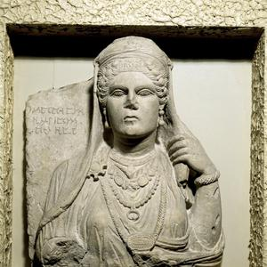
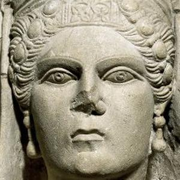
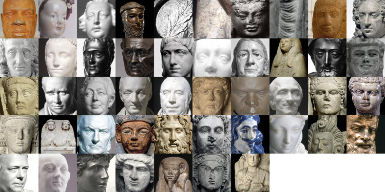

## A demonstration script for facial detection

This repository holds a sample terminal script for interacting with the British Museum's [RDF endpoint](http://collection.britishmuseum.org) to retrieve images and then
using OpenCV, recognise faces within the images. These are then cropped and stored in a directory on your machine.

This is a very simple example and pulls  busts (100 of them) from the British Museum collection and uses them to
create image montages. Within the folder are all the files pulled from the example script.

This example script uses a very simple SPARQL query to retrieve 100 British Museum records of busts, where an image exists.

```
PREFIX skos: <http://www.w3.org/2004/02/skos/core#>
PREFIX crm: <http://erlangen-crm.org/current/>
PREFIX fts: <http://www.ontotext.com/owlim/fts#>
PREFIX bmo: <http://collection.britishmuseum.org/id/ontology/>
SELECT DISTINCT ?image<
WHERE {
  ?object bmo:PX_object_type ?object_type .
  ?object_type skos:prefLabel "bust" .
  ?object bmo:PX_has_main_representation ?image .
} LIMIT 100
```

An example detected face can be shown below:

Original image



Detected face



There are also two montages created at the end of this script:

All images originally pulled from RDF:


All faces identified within the original images:



**I am rubbish at Python, so this is a learning project.**

# To use

Clone this folder to your computer:

`$ git clone https://github.com/BritishMuseumDH/britishMuseumFaceDetection.git`

Change to the directory:

`$ cd britishMuseumFaceDetection`

Install the requirements (I recommend doing this in a virtual environment):

`$ pip install -r requirements.txt`

Now run the script (for example):

`$ python python britishMuseumFaces.py -p . -d bmimages -f facesDetected -r bmimagesResized -m montages -s 200 -o 'bmImages' `

There are several arguments that you use for this script:

Mandatory:
* Path: -p or --path
* Download directory: -d or --directory
* Faces directory: -f or --faces
* Resize directory: -r or --resized
* Montages directory: -m or --montages

Optional
* Size of cropped image: -s or --size (default 300)
* Output file: -o or --output (default bmImages)

This should run and output any error messages to your terminal. Within the script, progress is printed into your terminal
window. You should see the following messages when running for the first time:

* Image {filename} downloaded **Multiple times**
* Image path written to file **Multiple times**
* {filename} resized **Multiple times**
* Detecting faces in {filename} **Multiple times**
* Found {number of} faces within the image **Multiple times**
* The time taken to process face detection was: --- {x} seconds ---
* {Total number of } faces were identified in total
* The dimensions of the montage are {XbyY}
* Now creating image montage of all retrieved images
* Now resizing image montage of all retrieved images
* Now creating image montage of all faces detected in images
* Now resizing image montage of all faces detected in images
* Facial detection complete


# License

MIT for script. CC-BY-NC-SA for all image content, copyright the Trustees of the British Museum.

# Authors

* Daniel Pett, The British Museum @portableant
* Ben O'Steen, The British Library @benosteen
* Richard Wareham, Cambridge University @rjw57
